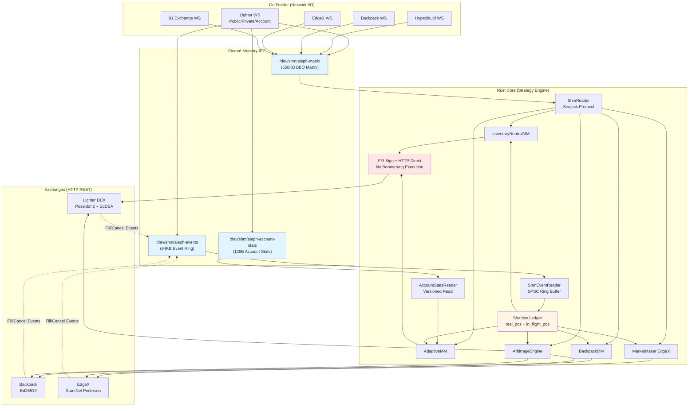

# AlephTX

Institutional-grade High-Frequency Trading framework for crypto perpetual markets. Split architecture: **Go** (network I/O, WebSocket ingestion) + **Rust** (strategy engine, direct HTTP execution), connected via lock-free shared memory IPC.

## Architecture



### Key Design Principles

- **Dual-Track IPC**: Track 1 (BBO state via seqlock matrix) + Track 2 (private events via SPSC ring buffer)
- **No Boomerang Execution**: Rust fires HTTP orders directly to exchanges. Never sends execution commands back to Go.
- **Optimistic Accounting**: Shadow ledger updates `in_flight_pos` before API call; background task reconciles via event stream.
- **Zero Heap Allocations** on hot path (quoting loop < 250ns per tick)

## Quick Start

```bash
# 1. Configure (unified config for all exchanges)
cp config.example.toml config.toml
# Edit config.toml: set feeder_enabled=true for your exchange

# 2. Set credentials (only private keys/API keys)
cp .env.lighter.example .env.lighter
# Fill in your exchange credentials

# 3. Build & Run (always use Makefile)
make build              # Build Go feeder + Rust core
make lighter-up         # Start Lighter DEX (or edgex-up, backpack-up)
make lighter-logs       # Monitor logs
make lighter-down       # Stop and clean up
```

See [Configuration Guide](docs/CONFIGURATION.md) for detailed setup.

## Make Targets

| Target | Description |
|--------|-------------|
| `make build` | Build all binaries (Go feeder + Rust) |
| `make lighter-up STRATEGY=<name>` | Start Lighter DEX strategy (default: inventory_neutral_mm) |
| `make lighter-down` / `lighter-logs` | Stop / view logs for Lighter |
| `make backpack-up STRATEGY=<name>` | Start Backpack strategy |
| `make backpack-down` / `backpack-logs` | Stop / view logs for Backpack |
| `make edgex-up STRATEGY=<name>` | Start EdgeX strategy |
| `make edgex-down` / `edgex-logs` | Stop / view logs for EdgeX |
| `make status` | Show all running strategies across exchanges |
| `make test-up` / `test-down` / `test-logs` | Integration test environment |
| `make clean` | Clean build artifacts |

## Project Structure

```
aleph-tx/
├── config.toml          # Unified configuration (feeder + strategy, all exchanges)
├── .env.lighter         # Lighter DEX credentials (private keys only)
├── .env.edgex           # EdgeX credentials (private keys only)
├── .env.backpack        # Backpack credentials (private keys only)
├── feeder/              # Go: WebSocket ingestion, CGO FFI exports
│   ├── exchanges/       #   Exchange adapters (Lighter, Hyper, Backpack, EdgeX, 01)
│   ├── shm/             #   Shared memory writers (BBO matrix, event ring, account stats)
│   └── config/          #   TOML config loader
├── src/                 # Rust: HFT strategy engine
│   ├── strategy/        #   Strategy implementations (inventory_neutral_mm, adaptive_mm, arbitrage, etc.)
│   ├── exchanges/       #   Exchange integrations (Backpack, EdgeX, Lighter)
│   ├── native/          #   Native FFI libraries (Lighter Ed25519 signer .so)
│   └── types/           #   Core types + C-ABI event struct (64 bytes)
├── examples/            # Entry point binaries for make targets + debug/benchmark tools
├── docs/                # Reference documentation
│   └── CONFIGURATION.md #   Configuration guide
└── proto/               # gRPC service definitions
```

## Supported Exchanges

| Exchange | Role | Auth | Status |
|----------|------|------|--------|
| **Lighter DEX** | Primary (HFT MM) | Poseidon2 + EdDSA via FFI | Production |
| **Backpack** | Secondary (MM) | Ed25519 | Ready |
| **EdgeX** | Secondary (MM) | StarkNet Pedersen L2 | Production |
| **Hyperliquid** | Data feed | - | Feed only |
| **01 Exchange** | Data feed | - | Feed only |

## Strategies

### Inventory-Neutral MM (Primary)

The production strategy (`src/strategy/inventory_neutral_mm.rs`) implements config-driven HFT market making via the `Exchange` trait:

- **Inventory Neutral**: Maintains near-zero net position (98.4% neutral in live testing)
- **Exchange Trait**: Works with any exchange implementing `Arc<dyn Exchange>`
- **Config-Driven**: All parameters externalized to `config.toml` (no hardcoded constants)
- **Shadow Ledger**: Optimistic `in_flight_pos` tracking with background reconciliation
- **Batch Quoting**: Paired bid/ask via `place_batch` for atomic updates

### Adaptive MM

The adaptive strategy (`src/strategy/adaptive_mm.rs`) implements fee-aware HFT with microstructure signals:

- **Fee-Aware Spread**: Ensures spread > round-trip fee (0.76 bps for Premium account)
- **Microstructure Tracker**: EWMA fast/slow momentum, realized volatility, adverse selection score
- **Inventory Skew**: Linear position-based adjustment to flatten exposure
- **Dynamic Sizing**: Position scaled by leverage and available balance from account stats

## Configuration

```toml
# config.toml (copy from config.example.toml)
[backpack]
risk_fraction = 0.20          # Fraction of equity at risk
min_spread_bps = 6.0          # Minimum half-spread (bps)
vol_multiplier = 2.5          # spread = max(min_spread, vol * multiplier)
requote_interval_ms = 3000    # Re-quote interval

[edgex]
risk_fraction = 0.10
min_spread_bps = 8.0          # Higher fees -> wider spread
requote_interval_ms = 5000    # Rate limit: 2 req/2s
```

## Credentials

```bash
# .env.lighter
API_KEY_PRIVATE_KEY=<hex>
LIGHTER_ACCOUNT_INDEX=<int>
LIGHTER_API_KEY_INDEX=<int>

# .env.backpack
BACKPACK_PUBLIC_KEY=<key>
BACKPACK_SECRET_KEY=<key>

# .env.edgex
EDGEX_STARK_PRIVATE_KEY=<hex>
EDGEX_ACCOUNT_ID=<id>
```

## Roadmap

- **Risk Management**: Circuit breaker, max drawdown limit, kill switch
- **Observability**: Prometheus metrics, Grafana dashboard, alerting
- **Cross-Exchange Arbitrage**: Statistical arb between Lighter/Backpack/EdgeX
- **WebSocket Execution**: Replace REST with WS for lower latency order placement
- **Backtesting Framework**: Historical data replay with strategy simulation
- **gRPC Control Plane**: Remote strategy management (proto/ definitions ready)
- **Multi-Asset Support**: BTC-PERP, SOL-PERP, and other perpetual markets

## Documentation

| Document | Description |
|----------|-------------|
| `CLAUDE.md` (root + per-directory) | Auto-loaded technical context for Claude Code |
| `docs/QUICKSTART.md` | Step-by-step deployment guide |
| `docs/ADAPTIVE_MM_GUIDE.md` | Adaptive MM operational guide |
| `docs/DUAL_TRACK_IPC.md` | IPC architecture deep-dive |
| `docs/ORDER_EXECUTION_REDESIGN.md` | Order execution architecture decisions |
| `CHANGELOG.md` | Version history |

## Disclaimer

This software is for educational and research purposes. Trading cryptocurrencies involves substantial risk of loss. Use at your own risk.
