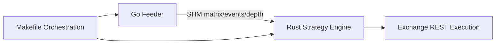

# AlephTX 全仓库深度 Review（2026-03-09）

## 1) Review 范围

本次 review 覆盖 Rust 核心引擎、Go feeder、构建/运行脚本与配置加载路径，重点关注：

- 生产稳定性（panic 风险、错误处理）
- 运行一致性（启动脚本与配置/SHM 生命周期）
- 可运维性（环境依赖、可移植性）

---

## 2) 总体评价

- 架构分层整体清晰：`feeder/` 与 `src/` 责任边界明确，构建也可一次完成（`make build` + `make build-feeder` 通过）。
- 主要风险集中在**运行脚本一致性**和**生产路径中的 unwrap/panic**，这些问题不会在编译期暴露，但会在实盘/故障时放大。

---

## 3) 关键问题（按优先级）

## P0 - `backpack-up` 启动路径与配置注入不一致，可能直接导致 feeder 启动失败

### 证据
- `backpack-up` 在 feeder 启动时使用 `.env.lighter`，而不是 `.env.backpack`。  
- 同时该目标在 `feeder/` 子目录运行 `./feeder-app`，未传入配置参数；而 feeder 默认读取当前工作目录的 `config.toml`。  

### 影响
- 在 `feeder/config.toml` 不存在时，Backpack 流程可能直接失败；即使存在，也会与根目录配置产生漂移。

### 相关代码
- `Makefile` 第 121-123 行（错误 env + feeder 子目录启动）。
- `feeder/main.go` 第 20-27 行（配置默认路径逻辑）。

### 建议
- `backpack-up` 与 `lighter-up/edgex-up` 对齐：统一在仓库根目录启动 feeder，并明确配置来源（`config.toml` 或 `ALEPH_FEEDER_CONFIG`）。

---

## P1 - SHM 清理遗漏 depth 文件，存在“脏深度数据”残留风险

### 证据
- feeder 明确创建 `/dev/shm/aleph-depth`。  
- 但 Makefile 的 `*-up/*-down` 清理仅覆盖 matrix/events/account-stats，没有 depth。

### 影响
- 重启后可能读到旧深度数据，导致定价偏移（尤其是依赖 OBI/VWMicro 的策略）。

### 相关代码
- `feeder/main.go` 第 62-67 行（创建 depth SHM）。
- `Makefile` 第 68、106、119、157、170 行（清理列表缺失 `aleph-depth`）。

### 建议
- 统一将 `/dev/shm/aleph-depth` 纳入 up/down 清理集合。

---

## P1 - 生产请求路径存在大量 `unwrap()`，异常输入时会触发进程级崩溃

### 证据
- EdgeX 客户端在请求构造和 header 组装中多处 `unwrap()`（序列化、时间戳、HeaderValue 转换）。
- 主程序启动 Tokio runtime 也使用 `unwrap()`。

### 影响
- 一旦出现系统时钟异常、header 值异常或序列化边界 case，将 panic 退出；对实盘容错不友好。

### 相关代码
- `src/exchanges/edgex/client.rs` 第 87-90、103、107、142、153、157 行。
- `src/main.rs` 第 34 行。

### 建议
- 全部改为 `?` + typed error，上抛到统一错误处理层；main 中输出错误并优雅退出。

---

## P2 - `main.rs` 存在硬编码绝对路径，破坏环境可移植性

### 证据
- `BACKPACK_ENV_PATH` / `EDGEX_ENV_PATH` 读取失败时回退到 `/home/metaverse/.openclaw/workspace/aleph-tx/...`。

### 影响
- 非该目录部署时行为不可预测；CI/容器/新机器迁移成本高。

### 相关代码
- `src/main.rs` 第 113-115、142-144 行。

### 建议
- 仅允许环境变量或相对路径配置；若缺失则显式告警并跳过对应清算逻辑。

---

## P2 - 配置缺乏硬约束校验（tick/step 可为 0），存在数值稳定性隐患

### 证据
- `round_to_tick(val, tick)` 直接做除法，无 `tick > 0` 保护。
- 配置加载 `AppConfig::load` 完成后没有统一 `validate()`。

### 影响
- 配置错误时可能产生 `inf/NaN`，继而污染报价/下单参数。

### 相关代码
- `src/config.rs` 第 11-13 行。
- `src/config.rs` 第 225-228 行。

### 建议
- 增加 `validate()`：检查 `tick_size/step_size/risk_fraction/max_position` 等范围并在启动时 fail-fast。

---

## 4) 正向亮点

- `feeder/exchanges/base.go` 已实现指数退避 + jitter + circuit breaker，恢复策略比常见“固定 sleep 重连”更成熟。  
- Rust 与 Go 均能成功编译，基础工程健康度较好（见下方测试记录）。

---

## 5) 建议落地顺序

1. **先修 P0/P1（脚本一致性 + panic 去除）**：避免“能编译但实盘不稳”。
2. **再修 P2（路径/配置校验）**：提升部署可移植性与参数安全边界。
3. 增加一组 smoke checks：`make backpack-up` 启动前校验 config/env/shm 文件状态。
