# examples/

> Production-ready example programs that serve as entry points for `make` targets, plus debugging and benchmark utilities.

## Key Files

| File | Description |
|------|-------------|
| inventory_neutral_mm.rs | Inventory-Neutral MM (Lighter DEX) - production HFT strategy |
| adaptive_mm.rs | Adaptive MM (Lighter DEX) - fee-aware market maker |
| backpack_mm.rs | Backpack MM - Exchange trait demo with BackpackGateway |
| edgex_mm.rs | EdgeX MM - Exchange trait demo with EdgeXGateway (L2 Pedersen signature) |
| test_account_stats.rs | Simple account stats SHM reader demo |

### EdgeX Debugging & Signature Verification

| File | Description |
|------|-------------|
| debug_edgex_signature.rs | Debug L2 signature generation step-by-step |
| test_edgex_auth.rs | Test EdgeX API authentication flow |
| test_edgex_order.rs | End-to-end EdgeX order placement test |
| test_edgex_pedersen.rs | Verify EdgeX-compatible Pedersen hash output |
| check_edgex_key.rs | Validate EdgeX StarkNet key format |
| test_l2_signature.rs | L2 signature correctness test |
| test_signature_format.rs | Signature encoding format validation |
| test_order_simple.rs | Minimal order placement test |
| diagnostic_l2_hash.rs | Diagnostic output for L2 hash computation |
| verify_packing.rs | Verify field packing for L2 signature |
| test_packing.rs | Test shift-and-add field packing |

### Benchmarks

| File | Description |
|------|-------------|
| bench_pedersen.rs | Pedersen hash performance benchmark |
| bench_signature.rs | Full L2 signature pipeline benchmark |
| test_pedersen.rs | Pedersen hash correctness test |

## Architecture

```mermaid
graph TD
    subgraph "Example: inventory_neutral_mm.rs"
        INIT[Init Shadow Ledger] --> EC[Spawn Event Consumer]
        INIT --> SHM[Open SHM Matrix + Account Stats]
        SHM --> INMM[InventoryNeutralMM.run]
        EC -->|Background Reconciliation| INMM
        CTRLC[Ctrl+C] -->|Watch Channel| INMM
    end

    subgraph "Example: backpack_mm.rs"
        BP_INIT[Load Backpack Credentials] --> BP_CLIENT[BackpackClient::new]
        BP_CLIENT --> BP_GW[BackpackGateway::new]
        BP_GW --> BP_SHM[Open SHM Matrix]
        BP_SHM --> BP_LOOP[Simple MM Loop]
        BP_CTRLC[Ctrl+C] -->|Watch Channel| BP_LOOP
    end

    subgraph "Example: edgex_mm.rs"
        EX_INIT[Load EdgeX Credentials] --> EX_CLIENT[EdgeXClient::new]
        EX_CLIENT --> EX_GW[EdgeXGateway::new]
        EX_GW --> EX_SHM[Open SHM Matrix]
        EX_SHM --> EX_LOOP[Simple MM Loop]
        EX_CTRLC[Ctrl+C] -->|Watch Channel| EX_LOOP
    end
```



## Gotchas

- These are the actual binaries started by Makefile targets.
- All require the Go feeder to be running first (Makefile handles this).
- Environment variables loaded from `.env.lighter`, `.env.backpack`, `.env.edgex`, etc.
- Graceful shutdown: Ctrl+C triggers watch channel, strategy cancels all orders before exit.
- `edgex_mm.rs` now uses full L2 Pedersen signature (no longer a stub).

## Usage

```bash
# Unified commands (v3.3.0+)
make lighter-up                          # Default: inventory_neutral_mm
make lighter-up STRATEGY=adaptive_mm     # Adaptive MM
make backpack-up STRATEGY=simple_mm      # Backpack with strategy
make edgex-up STRATEGY=simple_mm         # EdgeX with strategy
```
