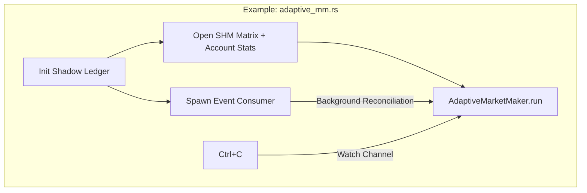

# examples/

> Production-ready example programs that serve as entry points for `make test-up` and `make adaptive-up`.

## Key Files

| File | Description |
|------|-------------|
| lighter_trading.rs | Lighter MM demo - initializes shadow ledger, event consumer, BBO reader, runs LighterMarketMaker |
| adaptive_mm.rs | Production adaptive MM - shadow ledger + account stats + AdaptiveMarketMaker (used by `make adaptive-up`) |
| test_account_stats.rs | Simple account stats SHM reader demo |

## Architecture

## Gotchas

- These are the actual binaries started by Makefile targets (`make test-up`, `make adaptive-up`).
- Both require the Go feeder to be running first (Makefile handles this).
- Environment variables loaded from `.env.lighter`: `API_KEY_PRIVATE_KEY`, `LIGHTER_ACCOUNT_INDEX`, `LIGHTER_API_KEY_INDEX`.
- Graceful shutdown: Ctrl+C triggers watch channel, strategy cancels all orders before exit.
