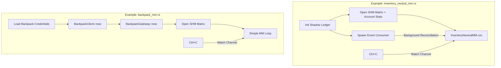

# examples/

> Production-ready example programs that serve as entry points for `make` targets.

## Key Files

| File | Description |
|------|-------------|
| inventory_neutral_mm.rs | Inventory-Neutral MM (Lighter DEX) - production HFT strategy (used by `make live-up`) |
| adaptive_mm.rs | Adaptive MM (Lighter DEX) - fee-aware market maker (used by `make adaptive-up`) |
| backpack_mm.rs | Backpack MM - Exchange trait demo with BackpackGateway (used by `make backpack-up`) |
| test_account_stats.rs | Simple account stats SHM reader demo |

## Architecture



## Gotchas

- These are the actual binaries started by Makefile targets.
- All require the Go feeder to be running first (Makefile handles this).
- Environment variables loaded from `.env.lighter`, `.env.backpack`, etc.
- Graceful shutdown: Ctrl+C triggers watch channel, strategy cancels all orders before exit.
- `backpack_mm.rs` is a demo of the Exchange trait abstraction - order execution is commented out by default.

## Usage

```bash
# Lighter DEX (production)
make live-up        # Inventory-Neutral MM
make adaptive-up    # Adaptive MM

# Backpack (Exchange trait demo)
make backpack-up    # Simple MM with BackpackGateway
```
