# examples/

> Production-ready example programs that serve as entry points for `make` targets.

## Key Files

| File | Description |
|------|-------------|
| inventory_neutral_mm.rs | Inventory-Neutral MM (Lighter DEX) - production HFT strategy |\n| adaptive_mm.rs | Adaptive MM (Lighter DEX) - fee-aware market maker |\n| backpack_mm.rs | Backpack MM - Exchange trait demo with BackpackGateway |\n| edgex_mm.rs | EdgeX MM - Exchange trait demo with EdgeXGateway (stub - L2 signature pending) |\n| test_account_stats.rs | Simple account stats SHM reader demo |

## Architecture

```mermaid
graph TD
    subgraph "Example: inventory_neutral_mm.rs"
        INIT[Init Shadow Ledger] --> EC[Spawn Event Consumer]
        INIT --> SHM[Open SHM Matrix + Account Stats]
        SHM --> INMM[InventoryNeutralMM.run]
        EC -->|Background Reconciliation| INMM
        CTRLC[Ctrl+C] -->|Watch Channel| INMM
    end

    subgraph "Example: backpack_mm.rs"
        BP_INIT[Load Backpack Credentials] --> BP_CLIENT[BackpackClient::new]
        BP_CLIENT --> BP_GW[BackpackGateway::new]
        BP_GW --> BP_SHM[Open SHM Matrix]
        BP_SHM --> BP_LOOP[Simple MM Loop]
        BP_CTRLC[Ctrl+C] -->|Watch Channel| BP_LOOP
    end

    subgraph "Example: edgex_mm.rs"
        EX_INIT[Load EdgeX Credentials] --> EX_CLIENT[EdgeXClient::new]
        EX_CLIENT --> EX_GW[EdgeXGateway::new]
        EX_GW --> EX_SHM[Open SHM Matrix]
        EX_SHM --> EX_LOOP[Simple MM Loop]
        EX_CTRLC[Ctrl+C] -->|Watch Channel| EX_LOOP
    end
```



## Gotchas

- These are the actual binaries started by Makefile targets.
- All require the Go feeder to be running first (Makefile handles this).
- Environment variables loaded from `.env.lighter`, `.env.backpack`, `.env.edgex`, etc.
- Graceful shutdown: Ctrl+C triggers watch channel, strategy cancels all orders before exit.
- `backpack_mm.rs` and `edgex_mm.rs` are demos of the Exchange trait abstraction.
- `edgex_mm.rs` uses stub gateway - full L2 signature integration pending.

## Usage

```bash
# Unified commands (v3.3.0+)
make lighter-up                          # Default: inventory_neutral_mm
make lighter-up STRATEGY=adaptive_mm     # Adaptive MM
make backpack-up STRATEGY=simple_mm      # Backpack with strategy
make edgex-up STRATEGY=simple_mm         # EdgeX with strategy (stub)
```
