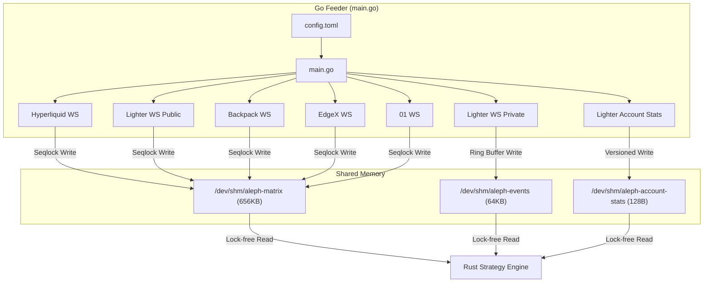

# feeder/

> Go-based market data feeder: multi-exchange WS ingestion -> shared memory BBO matrix + event ring buffer.

## Key Files

| File | Description |
|------|-------------|
| main.go | Entry point - spawns goroutines per exchange, initializes 3 SHM regions |
| config.toml | Exchange enable/disable, WS URLs, symbol mappings |

## Subdirectories

| Directory | Description |
|-----------|-------------|
| config/ | TOML config loader (`ExchangeConfig` struct) |
| exchanges/ | Exchange adapters (Lighter, Hyperliquid, Backpack, EdgeX, 01, Mock) |
| shm/ | Shared memory writers - BBO matrix, event ring buffer, account stats |
| test/ | Integration tests (auth, stream, order) |

## Architecture



## CGO Export Constraints (CRITICAL)

- **String Allocation**: When returning strings to Rust via `C.CString`, MUST provide `FreeCString()` for cleanup.
- **No Go Pointers in C**: Never pass Go GC-managed memory to C/Rust.
- **Error Handling**: CGO doesn't support multiple return values - use C-structs or error buffer pointers.

## Shared Memory Writers (IPC)

- **C-ABI Layout**: Structs shared with Rust MUST match byte-for-byte. Insert explicit padding to ensure exact sizes (64 bytes for events, 128 bytes for account stats).
- **Seqlock Protocol**: `Seq++ (Odd) -> Write Payload -> Seq++ (Even)`.
- **Atomic Operations**: Use `sync/atomic` for ring buffer `write_idx` and matrix versions.

## WebSocket Management

- **No Blocking**: WS read loops must not block on channel writes.
- **Auto-Reconnect**: All connections use `RunConnectionLoop` pattern with backoff.
- **SDK Usage**: Prefer official SDKs (e.g., `lighter-go`) for auth and stream parsing.

## Testing

```bash
make build-feeder   # Build Go feeder
make test-up        # Start feeder + test strategy
make test-logs      # Monitor logs
make test-down      # Stop and clean up
```
