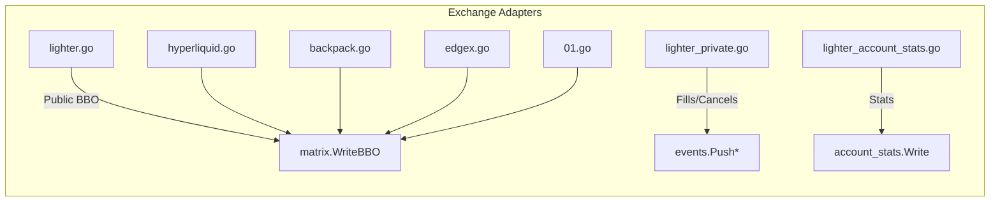

# feeder/exchanges/

> Multi-exchange WebSocket adapters: connects to exchange streams, parses BBO, writes to shared memory.

## Key Files

| File | Description |
|------|-------------|
| base.go | `Exchange` interface + `RunConnectionLoop()` with auto-reconnect |
| common.go | Exchange/Symbol ID constants, `BuildReverseSymbolMap()` helper |
| binance.go | Binance Futures bookTicker WS (combined stream, no auth) |
| lighter.go | Lighter DEX public orderbook WS (market BBO) |
| lighter_auth.go | Lighter Poseidon2 + EdDSA auth token generator (cached) |
| lighter_private.go | Lighter private WS (orders, trades, fills -> event ring buffer) |
| lighter_account_stats.go | Lighter account stats WS + REST polling (collateral, leverage) |
| hyperliquid.go | Hyperliquid L2 book WS (`l2Book` channel) |
| backpack.go | Backpack depth WS (`depth.{symbol}` channel) |
| edgex.go | EdgeX quote API WS (`depth.{contractId}.15`) |
| 01.go | 01 Exchange orderbook WS |

## Exchange ID Constants

| ID | Exchange |
|----|----------|
| 1 | Hyperliquid |
| 2 | Lighter |
| 3 | EdgeX |
| 4 | 01 |
| 5 | Backpack |
| 6 | Binance |

## Symbol ID Constants

| ID | Symbol |
|----|--------|
| 1001 | BTC-PERP |
| 1002 | ETH-PERP |

## Architecture

## Gotchas

- All adapters use `RunConnectionLoop()` for infinite reconnect with 3s backoff.
- Lighter private stream requires auth token from `lighter_auth.go` (Poseidon2 + Schnorr).
- Timestamp formats vary: Lighter (ms), Hyperliquid (ms), Backpack (us), EdgeX (current time).
