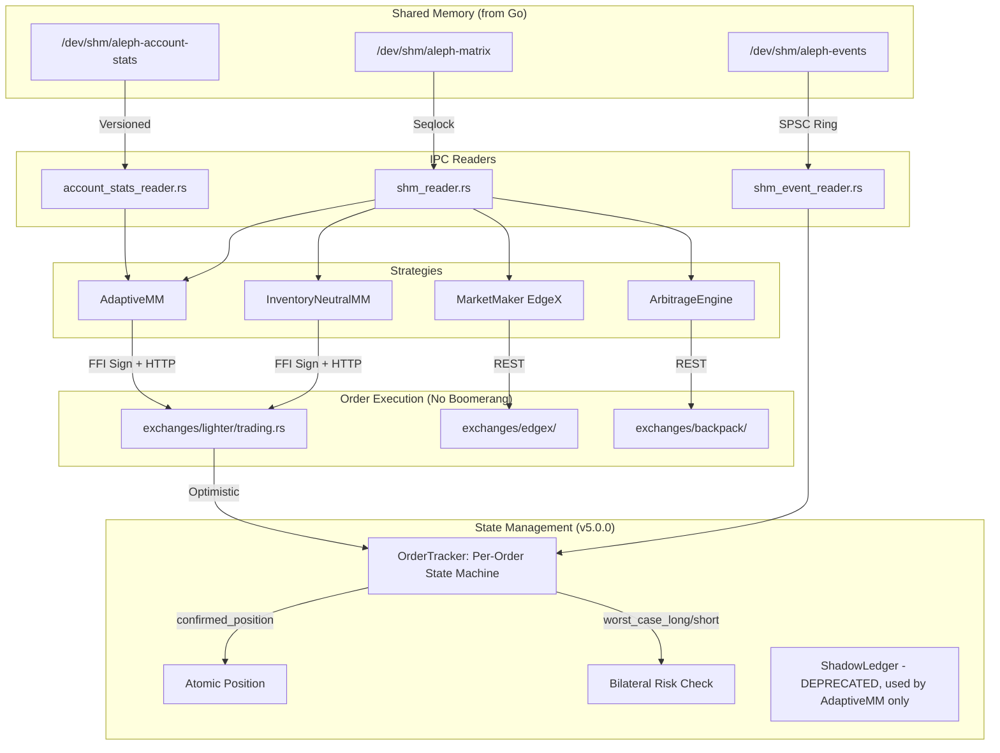

# src/

> Rust HFT core: lock-free SHM readers, shadow ledger, multi-exchange strategies, direct HTTP execution.

## Key Files (Root Level)

| File | Description |
|------|-------------|
| lib.rs | Module declarations and library exports (with backward-compatible re-exports) |
| main.rs | Entry point - loads config, initializes strategies, main polling loop |
| config.rs | `AppConfig` loader from config.toml, precision helpers (`round_to_tick`, `format_price`) |
| error.rs | `TradingError` enum with all error variants |
| exchange.rs | `Exchange` trait abstraction for unified trading interface |
| shm_reader.rs | Lock-free BBO matrix reader (seqlock protocol) |
| shm_event_reader.rs | Lock-free V2 event ring buffer reader (SPSC 128-byte) |
| account_stats_reader.rs | Account stats SHM reader (128-byte versioned) |
| order_tracker.rs | **v5.0.0** Per-order state machine (`RwLock<TrackerState>`, worst-case bilateral risk) |
| shadow_ledger.rs | **DEPRECATED** Legacy dual-accumulator position tracking (`real_pos` + `in_flight_pos`) |

## Subdirectories

| Directory | Description |
|-----------|-------------|
| strategy/ | Strategy implementations (arbitrage, MM, adaptive MM, inventory-neutral MM) |
| exchanges/ | **Modular exchange integrations** (lighter/, backpack/, edgex/) - see `exchanges/CLAUDE.md` |
| types/ | Core type definitions (events, orders, symbols) |

**Note**: `lighter_ffi.rs` and `lighter_trading.rs` have been moved to `exchanges/lighter/`. Use `crate::lighter_ffi` and `crate::lighter_trading` (re-exported from `lib.rs`) for backward compatibility.

## Architecture



## FFI & Memory Safety (CRITICAL)

- **Async Starvation**: FFI calls <100us (e.g. Lighter Poseidon2+EdDSA) MAY be called synchronously. Longer FFI calls (e.g. StarkNet ECDSA) MUST use `tokio::task::spawn_blocking()`. Never block Tokio async workers with heavy computation.
- **Memory Leaks**: Go-allocated `C.CString` MUST be freed via Go's `FreeCString()`. Do NOT use `libc::free` or `CString::from_raw`.

## Hot-Path Constraints (Quoting Loop)

- **ZERO Heap Allocations** in `try_read`, `check_arbitrage`, `on_idle`. No `String`, `Vec::push`, `Box::new`.
- **Rollback Discipline (v5.0.0)**: If order fails, call `tracker.mark_failed(client_order_id)`. Order lifecycle transitions to `Rejected`, `pending_exposure()` returns 0 automatically. No manual accumulator rollback needed.

## Concurrency & Atomics

- **Memory Barriers (v5.0.0)**: Use `AtomicU64::load(Ordering::Acquire)` + `compiler_fence(Ordering::Acquire)` for SHM reads. `read_volatile` does NOT provide hardware barriers on ARM/Apple Silicon.
- **RwLock Hygiene**: Extract data, drop lock guard, THEN execute async HTTP calls.

## Math & Precision

- Never hardcode format strings. Always use `round_to_tick(val, tick_size)`.
- **Division by Zero**: If `last_price == 0.0` at boot, bypass deviation check to prevent NaN.

## Testing

```bash
make build                              # Build Rust + Go
make test-up                            # Integration test (feeder + lighter_trading example)
make lighter-up STRATEGY=lighter_adaptive_mm    # Production adaptive MM
```
