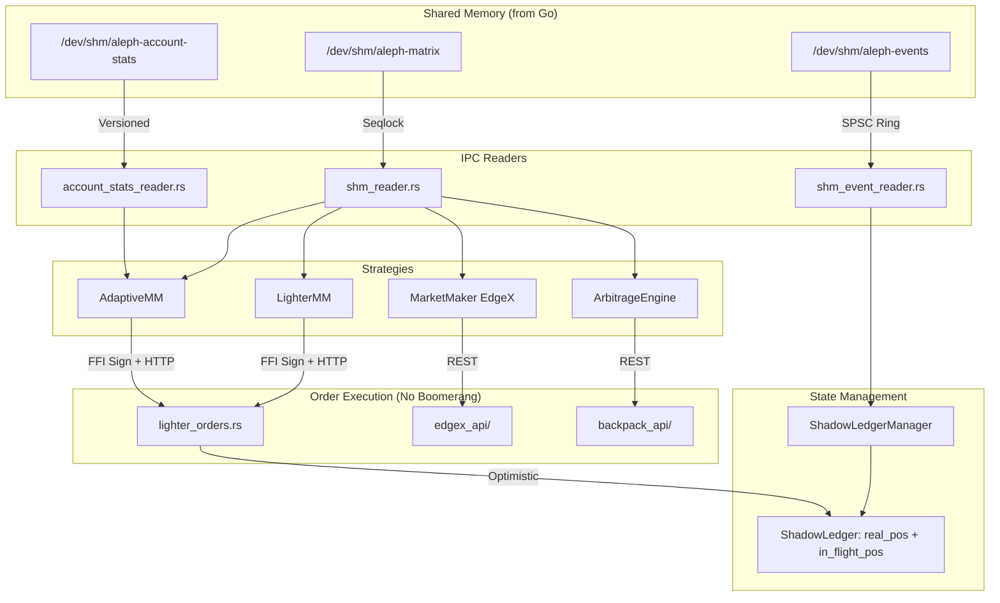

# src/

> Rust HFT core: lock-free SHM readers, shadow ledger, multi-exchange strategies, direct HTTP execution.

## Key Files (Root Level)

| File | Description |
|------|-------------|
| lib.rs | Module declarations and library exports |
| main.rs | Entry point - loads config, initializes strategies, main polling loop |
| config.rs | `AppConfig` loader from config.toml, precision helpers (`round_to_tick`, `format_price`) |
| error.rs | `TradingError` enum with all error variants |
| shm_reader.rs | Lock-free BBO matrix reader (seqlock protocol) |
| shm_event_reader.rs | Lock-free event ring buffer reader (SPSC) |
| account_stats_reader.rs | Account stats SHM reader (128-byte versioned) |
| shadow_ledger.rs | Optimistic position tracking (`real_pos` + `in_flight_pos`) |
| lighter_ffi.rs | FFI bindings to Go signer (`lighter-signer-linux-amd64.so`) |
| lighter_orders.rs | HTTP order execution with optimistic accounting |
| lighter_trading.rs | High-level Lighter trading API wrapper |

## Subdirectories

| Directory | Description |
|-----------|-------------|
| strategy/ | Strategy implementations (arbitrage, MM, adaptive MM) |
| backpack_api/ | Backpack exchange REST client (Ed25519 auth) |
| edgex_api/ | EdgeX REST client (StarkNet L2 Pedersen hash auth) |
| types/ | Core type definitions (events, orders, symbols) |

## Architecture



## FFI & Memory Safety (CRITICAL)

- **Async Starvation**: ANY FFI call MUST be wrapped in `tokio::task::spawn_blocking()`. Never block Tokio async workers.
- **Memory Leaks**: Go-allocated `C.CString` MUST be freed via Go's `FreeCString()`. Do NOT use `libc::free` or `CString::from_raw`.

## Hot-Path Constraints (Quoting Loop)

- **ZERO Heap Allocations** in `try_read`, `check_arbitrage`, `on_idle`. No `String`, `Vec::push`, `Box::new`.
- **Rollback Discipline**: If order fails, MUST execute `ledger.add_in_flight(-signed_size)`. No ghost positions.

## Concurrency & Atomics

- **Memory Barriers**: Use `AtomicU64::load(Ordering::Acquire)` for SHM reads. Do NOT use `read_volatile` for cross-process sync.
- **RwLock Hygiene**: Extract data, drop lock guard, THEN execute async HTTP calls.

## Math & Precision

- Never hardcode format strings. Always use `round_to_tick(val, tick_size)`.
- **Division by Zero**: If `last_price == 0.0` at boot, bypass deviation check to prevent NaN.

## Testing

```bash
make build        # Build Rust + Go
make test-up      # Integration test (feeder + lighter_trading example)
make adaptive-up  # Production adaptive MM
```
