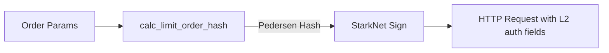

# src/edgex_api/

> EdgeX exchange REST API client with StarkNet L2 Pedersen hash signature authentication.

## Key Files

| File | Description |
|------|-------------|
| client.rs | `EdgeXClient` - REST client with L2 auth, order/position methods |
| model.rs | Data structures: `CreateOrderRequest`, `OpenOrder`, `Position`, enums (`OrderSide`, `TimeInForce`) |
| signature.rs | `SignatureManager` - StarkNet Pedersen hash calculation for L2 order signing |
| utils.rs | Reserved for utilities (empty) |

## API Methods

| Method | Description |
|--------|-------------|
| `place_order()` | Create order with L2 Stark signature |
| `cancel_order()` | Cancel single order |
| `cancel_all_orders()` | Cancel all orders for a contract |
| `get_positions()` | Fetch open positions |
| `get_fills()` | Fill history |

## Signature Flow

## Gotchas

- Contract ID for ETH-USDC perpetual: `10000002`.
- L2 signature includes nonce, expiry, and asset IDs packed via shift-and-add construction.
- `TimeInForce` options: GTC, IOC, FOK, POST_ONLY.
