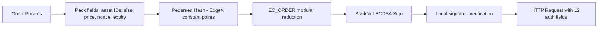

# src/exchanges/edgex/

> EdgeX exchange REST API client with StarkNet L2 Pedersen hash signature authentication and full Exchange trait gateway.

## Key Files

| File | Description |
|------|-------------|
| mod.rs | Module exports: `client`, `gateway`, `model`, `signature`, `pedersen` |
| client.rs | `EdgeXClient` - REST client with L2 auth, order/position methods |
| gateway.rs | `EdgeXGateway` - Exchange trait implementation (buy/sell/cancel/batch) |
| model.rs | Data structures: `CreateOrderRequest`, `OpenOrder`, `Position`, enums (`OrderSide`, `TimeInForce`) |
| signature.rs | `SignatureManager` - StarkNet Pedersen hash + EC_ORDER modular reduction + local verification |
| pedersen/mod.rs | Pedersen hash implementation (EdgeX-compatible, constant-point based) |
| pedersen/pedersen_points.rs | Pre-computed Pedersen constant points for hash computation |

## API Methods

| Method | Description |
|--------|-------------|
| `place_order()` | Create order with L2 Stark signature |
| `cancel_order()` | Cancel single order |
| `cancel_all_orders()` | Cancel all orders for a contract |
| `get_positions()` | Fetch open positions |
| `get_fills()` | Fill history |

## Signature Flow

## Configuration

- `collateral_resolution`: Asset resolution from EdgeX metadata (e.g., `1e6` for USDC). Used in order size/price packing for L2 signature.
- `synthetic_resolution`: Synthetic asset resolution from metadata.
- Contract ID for ETH-USDC perpetual: `10000002`.

## Gotchas

- Pedersen hash uses EdgeX-specific constant points, NOT the standard StarkNet points. See `pedersen/pedersen_points.rs`.
- L2 signature includes nonce, expiry, and asset IDs packed via shift-and-add construction.
- `EC_ORDER` modular reduction is applied to the final hash before signing - omitting this causes signature rejection.
- Local signature verification (`verify`) runs before sending to catch signing errors early.
- `TimeInForce` options: GTC, IOC, FOK, POST_ONLY.
- `collateral_resolution` and `synthetic_resolution` must match EdgeX metadata exactly, or order amounts will be wrong.
