# src/exchanges/lighter/

Lighter DEX (Arbitrum L2) integration with zkSync-style Poseidon2 + EdDSA signature scheme.

## Key Files

| File | Description |
|------|-------------|
| `ffi.rs` | FFI bindings to `lighter-signer-linux-amd64.so` (Go CGO library) |
| `trading.rs` | `LighterTrading` struct implementing `Exchange` trait |
| `mod.rs` | Module exports |

## Architecture

```mermaid
graph LR
  RT[Rust Trading] -->|OrderRequest| LT[LighterTrading]
  LT -->|FFI call| FFI[ffi.rs]
  FFI -->|CGO| GO[lighter-go SDK]
  GO -->|Poseidon2 + EdDSA| SIG[Signed TX]
  SIG -->|HTTP multipart/form-data| API[Lighter REST API]
  API -->|Fill/Cancel| EB[Event RingBuffer]
  EB -->|Reconcile| SL[Shadow Ledger]
```



## Signature Flow

1. Rust constructs `OrderRequest` (price, size, side, symbol)
2. Calls `sign_lighter_order()` FFI function with order params
3. Go CGO library:
   - Loads private key from `LIGHTER_PRIVATE_KEY` env var
   - Computes Poseidon2 hash of order fields
   - Signs with EdDSA (Schnorr on Baby Jubjub curve)
   - Returns signature as hex string
4. Rust sends HTTP POST with `multipart/form-data` to Lighter API
5. API validates signature (chain_id=304) and executes order

## Nonce Management

- **Lazy Initialization**: Nonce fetched from API on first order
- **Auto-Reset on Errors**:
  - `21711` (Invalid Expiry) → Refetch nonce
  - `21104` (Invalid Nonce) → Refetch nonce
- **Batch Orders**: Use `nonce` and `nonce + 1` for bid/ask pair

## Common Issues & Solutions

### 1. Invalid Signature (code 21120)
- **Cause**: Wrong chain_id, incorrect Content-Type, or price format mismatch
- **Fix**:
  - Verify `chain_id = 304` (mainnet) or `300` (testnet)
  - Use `Content-Type: multipart/form-data` (NOT `application/x-www-form-urlencoded`)
  - Ensure price format: `price * 100` (cents, e.g., $2061.50 → 206150)

### 2. Invalid Expiry (code 21711)
- **Cause**: Manually calculated timestamp instead of using SDK default
- **Fix**: Use `order_expiry = -1` for default (28 days, handled by SDK)

### 3. Price Format
- Lighter uses **cents**: $2061.50 → `206150`
- Python example: `price=4050_00` means $4050.00
- Rust: `let price_int = (order_req.price * 100.0) as u32;`

### 4. Base Amount Format
- Size in **base units**: 0.001 ETH → `1000` (multiply by 1e6)
- Rust: `let base_amount = (order_req.size * 1_000_000.0) as i64;`

## Endpoints

- **REST**: `https://mainnet.zklighter.elliot.ai/api/v1/`
- **WebSocket**: `wss://mainnet.zklighter.elliot.ai/stream`
- **FFI Library**: `src/native/lighter-signer-linux-amd64.so`

## Environment Variables

- `LIGHTER_PRIVATE_KEY` - EdDSA private key (hex string, loaded by Go CGO)
- `LIGHTER_API_KEY` - API key for authenticated endpoints (optional)

## Testing

```bash
make lighter-up STRATEGY=inventory_neutral_mm  # Start live trading
make lighter-logs                              # Monitor logs
make lighter-down                              # Stop
```

## Reference Implementation

Check `lighter-python` SDK for correct API usage:
- Repository: `git@github.com:elliottech/lighter-python.git`
- Key file: `lighter/api/transaction_api.py` (shows multipart/form-data)
- Example: `examples/create_modify_cancel_order_http.py`

## Gotchas

- **Chain ID is CRITICAL**: Must be 304 (mainnet) or 300 (testnet) for signature validation
- **HTTP Content-Type**: Must be `multipart/form-data`, not form-urlencoded (despite OpenAPI spec)
- **Nonce Race Conditions**: Batch orders use sequential nonces (n, n+1) - ensure atomic increment
- **Price Precision**: Always multiply by 100 before sending to API
