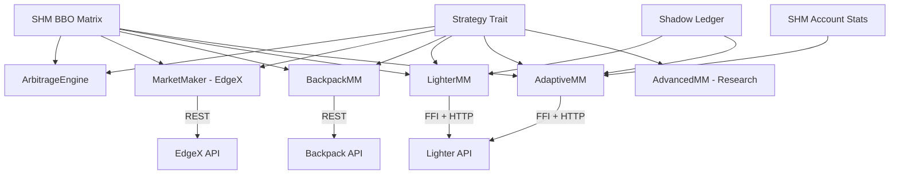

# src/strategy/

> Strategy implementations sharing the common `Strategy` trait. Each strategy reads SHM and executes orders directly.

## Key Files

| File | Description |
|------|-------------|
| mod.rs | `Strategy` trait definition (`on_bbo_update`, `on_idle`, `on_shutdown`) |
| arbitrage.rs | Cross-exchange statistical arbitrage scanner (25 bps threshold) |
| market_maker.rs | EdgeX market maker (EWMA volatility, dynamic sizing) |
| backpack_mm.rs | Backpack market maker (Ed25519 auth, momentum-based spread) |
| lighter_mm.rs | Lighter DEX MM (No-Boomerang, incremental quoting, shadow ledger) |
| adaptive_mm.rs | Premium account fee-aware HFT with microstructure signals |
| advanced_mm.rs | Avellaneda-Stoikov research implementation (Phase 2 reference) |

## Strategy Trait

```rust
pub trait Strategy {
    fn name(&self) -> &str;
    fn on_bbo_update(&mut self, symbol_id: u16, exchange_id: u8, bbo: &ShmBboMessage);
    fn on_idle(&mut self);
    fn on_shutdown(&mut self) -> Pin<Box<dyn Future<Output = ()> + Send + '_>>;
}
```

## Architecture



## Key Design Patterns

- **No Boomerang**: Strategies fire HTTP orders directly, never send commands back to Go.
- **Optimistic Accounting**: `in_flight_pos` updated before API call, reconciled via event ring buffer.
- **Incremental Quoting**: Only requote when price moves past threshold (reduces API load).
- **Fee-Aware Spread** (adaptive_mm): Ensures spread > round-trip fee (0.76 bps for Premium).

## Gotchas

- `lighter_mm.rs`: If `last_price == 0.0` at boot, bypass deviation check to avoid NaN.
- `adaptive_mm.rs`: Uses `MicrostructureTracker` (EWMA fast/slow, realized vol, adverse selection).
- `advanced_mm.rs`: Reference only - not production-ready.
- Order TTL: Stale orders canceled after 30s (lighter_mm) to prevent position drift.
