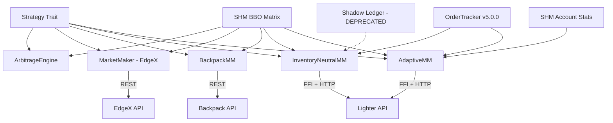

# src/strategy/

> Strategy implementations sharing the common `Strategy` trait. Each strategy reads SHM and executes orders directly.

## Key Files

| File | Description |
|------|-------------|
| mod.rs | `Strategy` trait definition (`on_bbo_update`, `on_idle`, `on_shutdown`) |
| arbitrage.rs | Cross-exchange statistical arbitrage scanner (25 bps threshold) |
| edgex_mm.rs | EdgeX market maker V3 (EWMA volatility, dynamic sizing, legacy direct API) |
| backpack_mm.rs | Backpack market maker (Ed25519 auth, momentum-based spread) |
| lighter_adaptive_mm.rs | Lighter DEX adaptive MM (premium account, fee-aware, microstructure signals) |
| inventory_neutral_mm.rs | Inventory-Neutral MM - production HFT strategy (Avellaneda-Stoikov pricing, Exchange trait) |

## Strategy Trait

```rust
pub trait Strategy {
    fn name(&self) -> &str;
    fn on_bbo_update(&mut self, symbol_id: u16, exchange_id: u8, bbo: &ShmBboMessage);
    fn on_idle(&mut self);
    fn on_shutdown(&mut self) -> Pin<Box<dyn Future<Output = ()> + Send + '_>>;
}
```

## Architecture



## Key Design Patterns

- **No Boomerang**: Strategies fire HTTP orders directly, never send commands back to Go.
- **Optimistic Accounting (v5.0.0)**: Per-order `start_tracking()` before API call. `mark_failed()` on error. Reconciled via `OrderTracker.apply_event()` from V2 event ring buffer.
- **Incremental Quoting**: Only requote when price moves past threshold (reduces API load).
- **Fee-Aware Spread** (adaptive_mm): Ensures spread > round-trip fee (0.76 bps for Premium).

## Gotchas

- `lighter_mm.rs` has been deleted. `inventory_neutral_mm.rs` is the production replacement.
- `adaptive_mm.rs`: Uses `MicrostructureTracker` (EWMA fast/slow, realized vol, adverse selection).
- Order TTL: Stale orders canceled after 30s (lighter_mm) to prevent position drift.
